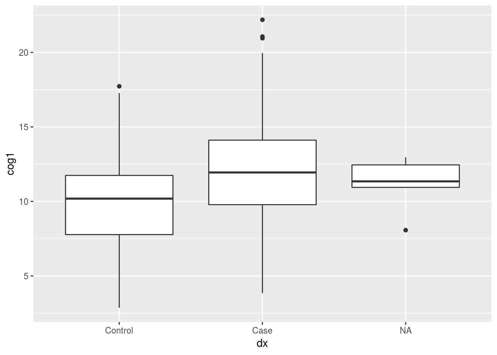

# Importing Data into R

## Read in data

The two datasets we will be using are:

1. **messy_demographic.csv:**
  * 5 variables: 
    + subject identifier (subject_ID), age, sex, ethnicity, and diagnosis (dx) 

2. **messy_cognitive.csv:**
  * 4 variables: 
    + subject identifier (subID), and three cognitive scores (cog1, cog2, cog3) 

In order to view and manipulate this data in R, we need to *import* the data into our R workspace (the same as you would open a file in Excel to edit it).

*Rstudio trick:*

* Click on the `Environment` Tab, then click on `Import Dataset` --> `From Text File (readr)`
* Navigate the browser window to the location of *messy_cognitive.csv* and click **Open**
* This opens a text reader window: You see the raw text on the top and what R will read in (the data frame) at the bottom
* In my view, it looks like the R is not going to read in the first line as a header..to change this
* switch the **Heading** option on the right to **yes**
* Click **Import**
* Now, if you look at the **Environment** tab you should see that *demo_df* has been loaded into R, It has 350 rows (or observations) and 5 variables
* So that you do not have to type this again tomorrow - go to History, click on the line "demo_df <- read.csv(...)" and then click on **To Source**
* Repeat this whole process for *messy_demographic.csv*


```r
library(readr)
demo_df <- read_csv("~/Downloads/messy_demographic.csv")
cog_df <- read_csv("~/Downloads/messy_cognitive.csv")
```


* What you actually did was use the `read_csv` function... to find out more about this option you can type `?read_csv` in the Console
* This is the basic syntax of R functions: some.function("stuff inside to do the function on")
* The *help document* for the `read_csv` function is shown in the **Help** tab

Now we have two **"data frames"** loaded into our workspace. They are called demo_df and cog_df.

-------

## Basic data summaries and visualization ( head, tail, describe() )

+ Now that we have the data loaded, how do we just look at it? The simplest way is with the "View" function within RStudio.
+ In Enviroment tab, click on the little spreadsheet to the far right of the `demo_df` row. This shows you your data in what looks like a spreadsheet - but you cannot edit it!

To look at the top six rows of your data:


```r
head(demo_df)
```

```
## # A tibble: 6 x 5
##   subject_ID age     sex ethnicity dx   
##   <chr>      <chr> <dbl> <chr>     <chr>
## 1 SUB_1      43        0 Cauc      0    
## 2 SUB_2      47        1 Cauc      1    
## 3 SUB_3      69        1 Cauc      1    
## 4 SUB_4      51        0 Cauc      1    
## 5 SUB_5      52        1 Cauc      0    
## 6 SUB_6      71        0 AA        1
```

To look at the bottom six rows:


```r
tail(cog_df)
```

```
## # A tibble: 6 x 4
##   subID      cog1             cog2             cog3            
##   <chr>      <chr>            <chr>            <chr>           
## 1 subject345 10.5491439098318 29.0366805293698 50.0341778674542
## 2 subject346 13.7560798734217 21.047620123942  11.2510017219872
## 3 subject347 16.4949897425522 33.323511618334  2.42614834379569
## 4 subject348 11.1612493587292 30.8723352333704 16.0049438698844
## 5 subject349 15.3654440645612 29.7598065423247 44.3994545119479
## 6 subject350 13.993297479479  28.3229119000634 11.2012255384154
```

Using the function `names()` tells us what all the variables in our dataframe are called.


```r
names(demo_df)
```

```
## [1] "subject_ID" "age"        "sex"        "ethnicity"  "dx"
```

the `ls()` function does the same thing, except it returns the variables in alphabetical order


```r
ls(demo_df)
```

```
## [1] "age"        "dx"         "ethnicity"  "sex"        "subject_ID"
```

That was all nice, but we want to find out more about this data we can use `summary()`


```r
summary(demo_df)
```

```
##   subject_ID            age                 sex         
##  Length:350         Length:350         Min.   :   0.00  
##  Class :character   Class :character   1st Qu.:   0.00  
##  Mode  :character   Mode  :character   Median :   1.00  
##                                        Mean   :  29.44  
##                                        3rd Qu.:   1.00  
##                                        Max.   :9999.00  
##                                        NA's   :3        
##   ethnicity              dx           
##  Length:350         Length:350        
##  Class :character   Class :character  
##  Mode  :character   Mode  :character  
##                                       
##                                       
##                                       
## 
```

```r
summary(cog_df)
```

```
##     subID               cog1               cog2          
##  Length:350         Length:350         Length:350        
##  Class :character   Class :character   Class :character  
##  Mode  :character   Mode  :character   Mode  :character  
##      cog3          
##  Length:350        
##  Class :character  
##  Mode  :character
```

---------

## Data cleaning

* Now that you have looked at your data - you might have noticed that there are a couple problems
The RA that you have been working with has coded missing values in three different ways ("9999", "missing", and "")
* We first need to set these all to NA - which R recognizes as missing value:

The following will take all values in demo_df that are equal to "", "missing", or "9999", and code them as missing in a way that R understands:


```r
demo_df[demo_df==""] <- NA
demo_df[demo_df=="missing"] <- NA
demo_df[demo_df=="9999"] <- NA
```

Because R is "smart", it categorizes data types automatically when data are loaded. Before working with new data, especailly if it is real (i.e. messy), it is important to tell R what kind of data
you are dealing with. This will be especially important when we discuss our statistical analyses... after all, R is statistical software.

The following will correctly format our variables for analyses:

* age is a numeric variable
* ethicity is a discrete factor
* sex is a discrete factor
* diagnosis is a discrete factor


```r
demo_df$age <- as.numeric(as.character(demo_df$age))
demo_df$ethnicity <- factor(demo_df$ethnicity,levels=c("Cauc","AA","As","In","Other"))
demo_df$sex <- factor(demo_df$sex, levels=c(0,1), labels=c("Male","Female"))
demo_df$dx <- factor(demo_df$dx, levels=c(0,1), labels=c("Control","Case"))
```

By indicating the levels of our factors, we have erased from R the memory that we once had values of
"", "9999", and "missing" (which up until now R had no reason to assume were not observations).

Let us now apply the same cleanup steps to our second data frame:

Remove missing:


```r
cog_df[cog_df==""] <- NA
cog_df[cog_df=="missing"] <- NA
cog_df[cog_df=="9999"] <- NA
```

Correctly format variables for analyses:


```r
cog_df$cog1 <- as.numeric(as.character(cog_df$cog1))
cog_df$cog2 <- as.numeric(as.character(cog_df$cog2))
cog_df$cog3 <- as.numeric(as.character(cog_df$cog3))
```

---------

## Merging data frames

In order to analyze the effect of sex on diagnosis, or perform any other comparison across our data frames, we should merge them. If you remember only this and nothing else today, it will still have been worth your time.

Conceptually, merging two data frames assumes that the rows in one correspond to rows in the other, even if they are not in the same order. In order to match up the correct rows between data frames we need to make sure that one column in each spreadsheet can act as a "key" (i.e. each row has a unique value in this key that is the same in both spreadsheets). In our case, we have one subject identifier column in each of our spreadsheets.

### First we need to make sure that the values in these columns are the same

We are going to make use a package called `stringr`, which was built to help us manipulate "strings" (string is a computer science word of sets of characters).  

*Note:* There are many ways to deal strings in r, too many ways in fact. `stringr` was created to make the commands working with strings more consistent so that your code will be easier for another person to read. 


```r
library(stringr)
cog_df$subject_ID <- str_replace(cog_df$subID,"subject","SUB_")
```

We can then merge the two datasets by specifying their names (in order x,y) and then specifying which columns are to be used as the key to merging the two data frames (by.x and by.y):


```r
library(dplyr)
```

```
## 
## Attaching package: 'dplyr'
```

```
## The following objects are masked from 'package:stats':
## 
##     filter, lag
```

```
## The following objects are masked from 'package:base':
## 
##     intersect, setdiff, setequal, union
```

```r
alldata <- inner_join(demo_df,cog_df,by="subject_ID")
```

Skipping ahead a little - now we can look at histograms of our numeric variables, just to see what we are dealing with:


```r
hist(cog_df$cog1)
```


```r
hist(cog_df$cog2)
```


```r
hist(cog_df$cog3)
```


```r
hist(demo_df$age)
```


Now that our data are loaded, cleaned, and merged, it is time to do some basic statistics!

---------

### STUDY QUESTION 1: What is the relationship between sex and diagnosis?

**For this question, our null hypothesis is that there is no difference in the number of males and females between our case and control diagnosis groups**

The ftable() function will give us a 2 x 2 contingency table of the frequency of observations in each category. the formula syntax "y ~ x" is common in R!


```r
ftable(data=alldata,dx~sex)
```

```
##        dx Control Case
## sex                   
## Male           37   90
## Female        127   86
```

We now want to save that table as an *object* called "dxXsex_table":


```r
dxXsex_table <- ftable(data=alldata,dx~sex)
```

Now, in order to test our null hypothesis using a chi-squared test, we simply apply the chisq.test() function to that table:


```r
chisq.test(dxXsex_table)
```

```
## 
## 	Pearson's Chi-squared test with Yates' continuity correction
## 
## data:  dxXsex_table
## X-squared = 28.415, df = 1, p-value = 9.791e-08
```

Similarly, we can use the nonparametric Fisher test to get a more exact test statistic:


```r
fisher.test(dxXsex_table)
```

```
## 
## 	Fisher's Exact Test for Count Data
## 
## data:  dxXsex_table
## p-value = 5.68e-08
## alternative hypothesis: true odds ratio is not equal to 1
## 95 percent confidence interval:
##  0.1686647 0.4567064
## sample estimates:
## odds ratio 
##   0.279488
```

*A bit more advanced!*
This will accomplish the same thing as ftable(), except that here we are *indexing* our alldata dataframe with the R syntax [<row>,<column>]. the blank value for <row> tells R that we want all rows.
The c("dx","sex") value for <columns> means we want to use the columns named "dx" and "sex". the table() function knows to arrange these as a 2 x 2 contingency table.


```r
table(alldata[ ,c("dx","sex")])
```

```
##          sex
## dx        Male Female
##   Control   37    127
##   Case      90     86
```


---------

### STUDY QUESTION 2: What is the relationship between diagnosis and cog1?

**for this question, our null hypothesis is that there is no difference in cog1 between our case and control diagnosis groups**


```r
t.test(cog1 ~ dx, data=alldata)
```

```
## 
## 	Welch Two Sample t-test
## 
## data:  cog1 by dx
## t = -6.347, df = 334.92, p-value = 7.133e-10
## alternative hypothesis: true difference in means is not equal to 0
## 95 percent confidence interval:
##  -2.871388 -1.512676
## sample estimates:
## mean in group Control    mean in group Case 
##              9.940047             12.132079
```

```r
library(ggplot2)

ggplot(alldata, aes(x=dx, y=cog1)) + 
  geom_boxplot()
```

```
## Warning: Removed 5 rows containing non-finite values (stat_boxplot).
```



---------

***P.S.****
Here is an R script with all of the steps we went over today!!
[Download Intro R script]( https://github.com/CAMH-SCWG/example-party/data/clean.R )
© 2018 GitHub, Inc.
Terms
Privacy
Security
Status
Help
Contact GitHub
Pricing
API
Training
Blog
About
