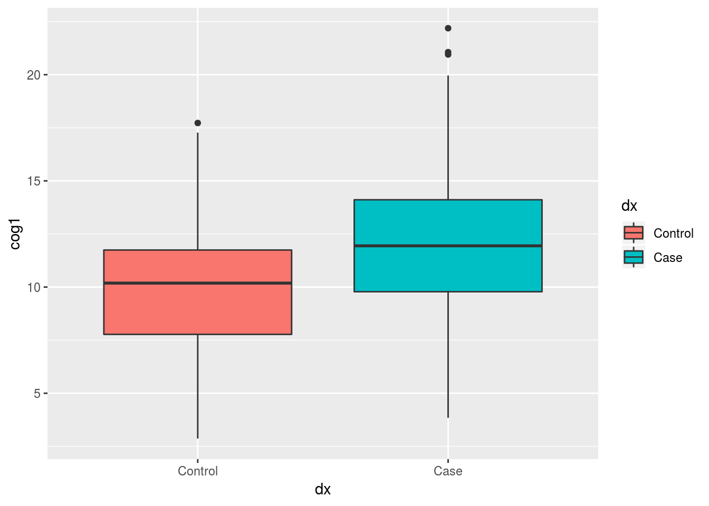

# Explore Data with R

## Getting Started

We will be using these three datasets for the analysis today..
Please download the following files:

1. [messy_demographic.csv](data/messy_demographic.csv) 
2. [messy_cognitive.csv](data/messy_cognitive.csv)
3. [messy_genotype.csv](data/messy_genotype.csv)

----


In this lesson, we are going to start building figures and table from our data. 

We are going to do so inside an R - notebook, so we can write ourself a little tutorial/report as what we are finding as we go!!

To write a report, we will make use of R-Markdown syntax. A cheatsheet for R Markdown Syntax is [here](https://www.rstudio.com/wp-content/uploads/2015/02/rmarkdown-cheatsheet.pdf).

Add a new chunk by clicking the *Insert Chunk* button on the toolbar or by pressing *Ctrl+Alt+I*.

We are also going to make heavy use of the "tidyverse" suite of packages. These packages include:

* **ggplot2**: for plotting ([ggplot cheat sheet](https://www.rstudio.com/wp-content/uploads/2015/03/ggplot2-cheatsheet.pdf))
* **dplyr** & **tidyr**: for manipulating dataframes ([data Wrangling cheat sheet](https://www.rstudio.com/wp-content/uploads/2015/02/data-wrangling-cheatsheet.pdf))
* **knitr**: for adding tables to our reports

For more info on programming with the tidyverse I highly recommend the online book [R for data science](http://r4ds.had.co.nz/) by Garrett Grolemund & Hadley Wickham.

### The packages for today


```r
library(tidyverse)
```

```
## ── Attaching packages ─────────────────────────────────────────────────────────────────────────────────────────────────────────────────────────────────────────── tidyverse 1.2.1 ──
```

```
## ✔ ggplot2 3.1.1     ✔ purrr   0.3.2
## ✔ tibble  2.1.1     ✔ dplyr   0.8.1
## ✔ tidyr   0.8.3     ✔ stringr 1.4.0
## ✔ readr   1.3.1     ✔ forcats 0.4.0
```

```
## ── Conflicts ────────────────────────────────────────────────────────────────────────────────────────────────────────────────────────────────────────────── tidyverse_conflicts() ──
## ✖ dplyr::filter() masks stats::filter()
## ✖ dplyr::lag()    masks stats::lag()
```

### reading in the data


```r
demo_df <- read_csv("~/Desktop/messy_demographic.csv")
cog_df <- read_csv("~/Desktop/messy_cognitive.csv")
gene_df <- read_csv("~/Desktop/messy_genotype.csv")
```

### copy and paste the cleaning code

These are all the things we learned to do in [Intro to R]("{{site.root}}/workshops/intro-R").

We are going to put them in one big chunk here.


```r
library(stringr)

demo_df[demo_df==""] <- NA
demo_df[demo_df=="missing"] <- NA
demo_df[demo_df=="9999"] <- NA
demo_df <- demo_df %>%
  mutate(age = as.numeric(age),
         ethnicity = factor(ethnicity),
         sex = factor(sex, levels = c(0,1), 
                      labels = c("Male", "Female")),
         dx = factor(dx, levels = c(0,1), 
                     labels = c("Control", "Case")))
cog_df[cog_df==""] <- NA
cog_df[cog_df=="missing"] <- NA
cog_df[cog_df=="9999"] <- NA
cog_df <- cog_df %>%
  mutate(cog1 = as.numeric(cog1),
         cog2 = as.numeric(cog2),
         cog3 = as.numeric(cog3),
         subject_ID = str_replace(subID, "subject", "SUB_")) %>%
  select(subject_ID, cog1:cog3)
gene_df[gene_df==""] <- NA
gene_df[gene_df=="missing"] <- NA
gene_df[gene_df=="9999"] <- NA
gene_df <- gene_df %>%
  mutate(genotype = factor(genotype,
                           levels=c(0,1,2), 
                           labels=c("AA","AG","GG")),
         subject_ID = str_replace(subID, "subject", "SUB_")) %>%
  select(-subID)
alldata <- demo_df %>%
  inner_join(cog_df, by="subject_ID") %>%
  inner_join(gene_df, by="subject_ID")
```

### Let's see what we have here

We can use the summary function (from base R) to get an idea of what is in our dataset.

`summary` will print some summary statistics for numeric variables are counts for our factors.


```r
summary(alldata)
```

```
##   subject_ID             age            sex      ethnicity         dx     
##  Length:350         Min.   :22.00   Male  :130   AA   : 70   Control:166  
##  Class :character   1st Qu.:43.00   Female:216   As   : 42   Case   :178  
##  Mode  :character   Median :49.00   NA's  :  4   Cauc :196   NA's   :  6  
##                     Mean   :50.38                In   : 19                
##                     3rd Qu.:58.00                Other: 14                
##                     Max.   :89.00                NA's :  9                
##                     NA's   :8                                             
##       cog1             cog2            cog3           genotype  
##  Min.   : 2.868   Min.   :20.23   Min.   :  0.05796   AA  :103  
##  1st Qu.: 8.783   1st Qu.:29.22   1st Qu.:  8.82092   AG  :145  
##  Median :10.939   Median :31.36   Median : 19.79222   GG  : 94  
##  Mean   :11.087   Mean   :31.66   Mean   : 25.04099   NA's:  8  
##  3rd Qu.:12.964   3rd Qu.:34.03   3rd Qu.: 35.55916             
##  Max.   :22.189   Max.   :44.74   Max.   :104.21326             
##  NA's   :5        NA's   :5       NA's   :9
```

## Using tableone to make Table 1 of your paper

Table one is a cool package that creates the demogaphics table. 

It takes four useful arguments
 + **data**: the data to plot
 + **vars**: the variables (from your data) to include in your table
 + **factorVars**: a list of which variables (in vars) should be treated as factors
 + **strata**: the name of a variable to split the table by.


```r
library(tableone)
CreateTableOne(alldata,
               vars = c("age", "sex",
                        "genotype","ethnicity",
                        "cog1", "cog2", "cog3"),
               factorVars = c("sex", 
                              "genotype","ethnicity"),
               strata = "dx")
```

```
##                   Stratified by dx
##                    Control       Case          p      test
##   n                  166           178                    
##   age (mean (SD))  50.42 (11.95) 50.57 (11.06)  0.905     
##   sex = Female (%)   127 (77.4)     86 (48.9)  <0.001     
##   genotype (%)                                  0.371     
##      AA               44 (27.2)     58 (33.1)             
##      AG               68 (42.0)     73 (41.7)             
##      GG               50 (30.9)     44 (25.1)             
##   ethnicity (%)                                 0.523     
##      AA               36 (22.4)     32 (18.4)             
##      As               17 (10.6)     25 (14.4)             
##      Cauc             92 (57.1)    100 (57.5)             
##      In               11 ( 6.8)      8 ( 4.6)             
##      Other             5 ( 3.1)      9 ( 5.2)             
##   cog1 (mean (SD))  9.94 (2.91)  12.13 (3.44)  <0.001     
##   cog2 (mean (SD)) 31.55 (3.88)  31.78 (3.79)   0.573     
##   cog3 (mean (SD)) 25.20 (21.76) 25.25 (20.39)  0.982
```

## Research Question 1 (two group comparison)

#### Is performance on Cognitive Scale One (cog1) associated with Diagnosis (Dx)

To test this statistically, we are going to run an independant samples t-test, using the base `t.test` function.

When we call the t.test function, we are going to use "formula" notation. we're our dependant variable goes on the left side of a `~` and the predictors go to the right
i.e. `y ~ x`.


```r
t.test(cog1 ~ dx, data = alldata)
```

```
## 
## 	Welch Two Sample t-test
## 
## data:  cog1 by dx
## t = -6.347, df = 334.92, p-value = 7.133e-10
## alternative hypothesis: true difference in means is not equal to 0
## 95 percent confidence interval:
##  -2.871388 -1.512676
## sample estimates:
## mean in group Control    mean in group Case 
##              9.940047             12.132079
```

One cool thing to remember about everything you do in R is that they generate useful objects we can save. 


```r
my_ttest_result <- t.test(cog1 ~ dx, data = alldata)
my_ttest_result$p.value
```

```
## [1] 7.13299e-10
```

### Plotting our result


```r
library(ggplot2)

ggplot(data = alldata, aes(x = dx, y = cog1)) +
  geom_boxplot()
```


#### removing NA rows before plotting

We can use tidyr's `drop_na` to remove rows with NA's in the `dx` column


```r
alldata %>% 
  drop_na(dx) %>%
  ggplot(aes(x = dx, y = cog1, fill = dx)) +
    geom_boxplot() 
```



#### Introducing the the dotplot geom

`geom_dotplot` has to be one of my favs.. Let's use it in combination with `geom_boxplot`. 

Let's also use the `labs()` call to relabel our axes with more descriptive titles. 

Note: by setting `labs(x = NULL)` we are removing the word "dx" from the bottom of the plot


```r
alldata %>% 
  drop_na(dx) %>%
  ggplot(aes(x = dx, y = cog1, fill = dx)) +
    geom_dotplot(binaxis = "y", stackdir = "center") +
    geom_boxplot(alpha = 0.5) +     # using "alpha" to make the box-plot semi-transparent
    labs(x = NULL,                  #remove dx from the bottom
         y = "Cognitive Score 1",   #add more desciptive title to y-axis
         fill = "Diagnosis")        # change dx to Diagnosis in the legend
```


## pretty tables with dplyr

In the section below we use two powerful tools from dplyr:

+ `summarise`: will calculate summary statistics, we are going to ask for three stats here:
   + n_age: the number of valid (i.e. not NA) values for age
   + mean_age: the mean for age (after removing NA values using the na.rm argument)
   + sd_age: the standard deviation for age after removing the NA values
+ `group_by`: will split the data by the "grouping" variable(s) you input
  + in this case we are asking for separate summary statistics for each diagnostic group, for each genotype
  
After calculating our summary table we are going to call `kable`, a function in the `knitr` package. That make the table appear nicer in our "knitted" report.

*Note*: kable has some kewl optional arguments you can use to format you table further, such as `col.names`, `digits`, and `align`. Check out `?kable` for more info..


```r
table_2 <- alldata %>%
  drop_na(dx) %>%
  group_by(dx,genotype) %>%
  summarise(n_age = sum(!is.na(age)), #the total number of observations that are NOT NA
            mean_age = mean(age, na.rm = T),
            sd_age = sd(age, na.rm = T))
```

```
## Warning: Factor `genotype` contains implicit NA, consider using
## `forcats::fct_explicit_na`
```

```r
library(knitr)
kable(table_2)
```


dx        genotype    n_age   mean_age      sd_age
--------  ---------  ------  ---------  ----------
Control   AA             43   52.00000   10.574002
Control   AG             66   49.92424   11.024882
Control   GG             50   49.94000   14.217566
Control   NA              4   47.50000   12.476645
Case      AA             57   55.08772   10.554756
Case      AG             71   48.61972   10.355628
Case      GG             43   48.37209   11.176129
Case      NA              2   38.00000    9.899495

## use forcats to label risk_carriers

When working with a genotype of interest, it's very common group participants into "carriers" and "non-carriers" of a risk-allele. In this dataset, our risk allele is the "G" genotype. We will create a new "risk_carrier" variable by combining levels of the genotype variable.

Working with factors in R can be...annoying. Especially when we want to create new factors out of old factors. For this reason, the tidyverse includes a `forcats` package. That includes many function (all starting with `fct_`) for doing stuff to factors. We will use `fct_collapse` to combine the "GG" and "AG" genotype factors into a new "carrier" level in a new factor.


```r
library(forcats)
alldata <- alldata %>%
  mutate(risk_carrier = fct_collapse(genotype,
                                     carrier = c("GG", "AG"),
                                     non_carrier = "AA"))
```

## Make a simple scatter plot

Let's use `geom_point()` and `geom_smooth`, together to create a scatter plot with a trendline.

*Note:* to make the trendline straight, we use "method = lm" when calling geom_smooth().


```r
alldata %>%
  ggplot(aes(x = age, y = cog1)) +
    geom_point() + 
    geom_smooth(method = "lm") 
```


## Use plotting to show the age by risk carrier interaction

When we add a new mapping of `color = risk_carrier` to the top line of our plot this mapping applies to *both* the points and the trendline. 

*Note:* we are using `drop_na` to remove the NA as a category so that it does not occur as a third color in our plot.


```r
alldata %>%
  drop_na(risk_carrier) %>%
  ggplot(aes(x = age, y = cog1, color = risk_carrier)) +
    geom_point() + 
    geom_smooth(method = "lm") 
```


We can use faceting to add and extra dimension - separate plots for male and female subjects.


```r
alldata %>%
  drop_na(risk_carrier,sex) %>%
  ggplot(aes(x = age, y = cog1, color = risk_carrier)) +
    geom_point() + 
    geom_smooth(method = "lm") +
    facet_wrap(~sex)
```


`facet_grid` will allow us to facet by TWO variables. In this case sex and dx.


```r
alldata %>%
  dplyr::filter(!is.na(risk_carrier), !is.na(sex), !is.na(dx)) %>%
  ggplot(aes(x = age, y = cog1, color = risk_carrier)) +
    geom_point() + 
    geom_smooth(method = "lm") +
    facet_grid(dx~sex)
```


## BONUS section - gather cognitive scores into one plot

One things we want to do sometimes is to stack data from multiple columns in one column. The reason why this is useful, will hopefully become apparent in the next example.

This "stacking" task (also refered to as "melting") is accomplished using `gather` from the `tidyr` package. `gather` creates two new columns from your data: "key" and "value".
 + **key**: a new column that will hold the old variable names from the gathered data
 + **value**: a new column that will hold the data values

After the **key** and **value** arguments. We can tell `gather` what colums we want to stack using the same syntax used by dplyr's `select()`. In this example, we tell it we want to gather our three cognitive scales using `starts_with()`.


```r
library(tidyr)
alldata %>% 
  gather(cog_scale, cognitive_score, starts_with("cog"))
```

```
## # A tibble: 1,050 x 9
##    subject_ID   age sex   ethnicity dx    genotype risk_carrier cog_scale
##    <chr>      <dbl> <fct> <fct>     <fct> <fct>    <fct>        <chr>    
##  1 SUB_1         43 Male  Cauc      Cont… GG       carrier      cog1     
##  2 SUB_2         47 Fema… Cauc      Case  AG       carrier      cog1     
##  3 SUB_3         69 Fema… Cauc      Case  AA       non_carrier  cog1     
##  4 SUB_4         51 Male  Cauc      Case  GG       carrier      cog1     
##  5 SUB_5         52 Fema… Cauc      Cont… AA       non_carrier  cog1     
##  6 SUB_6         71 Male  AA        Case  AA       non_carrier  cog1     
##  7 SUB_7         56 Fema… Cauc      Case  AA       non_carrier  cog1     
##  8 SUB_8         35 Fema… <NA>      Cont… GG       carrier      cog1     
##  9 SUB_9         42 Fema… Cauc      Cont… AG       carrier      cog1     
## 10 SUB_10        45 Fema… Other     Case  <NA>     <NA>         cog1     
## # … with 1,040 more rows, and 1 more variable: cognitive_score <dbl>
```

The beauty of gather is that it can be combined with other the rest of the tidyverse using the pipe. Let's feed out gathered result to ggplot.

*Note:* using `scales = "free"` when faceting will force ggplot to draw a separate axis for each subplot (by default, `scales = "fixed"`, meaning that the same axes are drawn for each plot).


```r
alldata %>%
  gather(cog_scale, cognitive_score, starts_with("cog")) %>%
  drop_na(risk_carrier, dx) %>%
  ggplot(aes(x = age, y = cognitive_score, color = risk_carrier)) +
    geom_point() + 
    geom_smooth(method = "lm") +
    facet_wrap(~cog_scale, scales = "free")  
```


