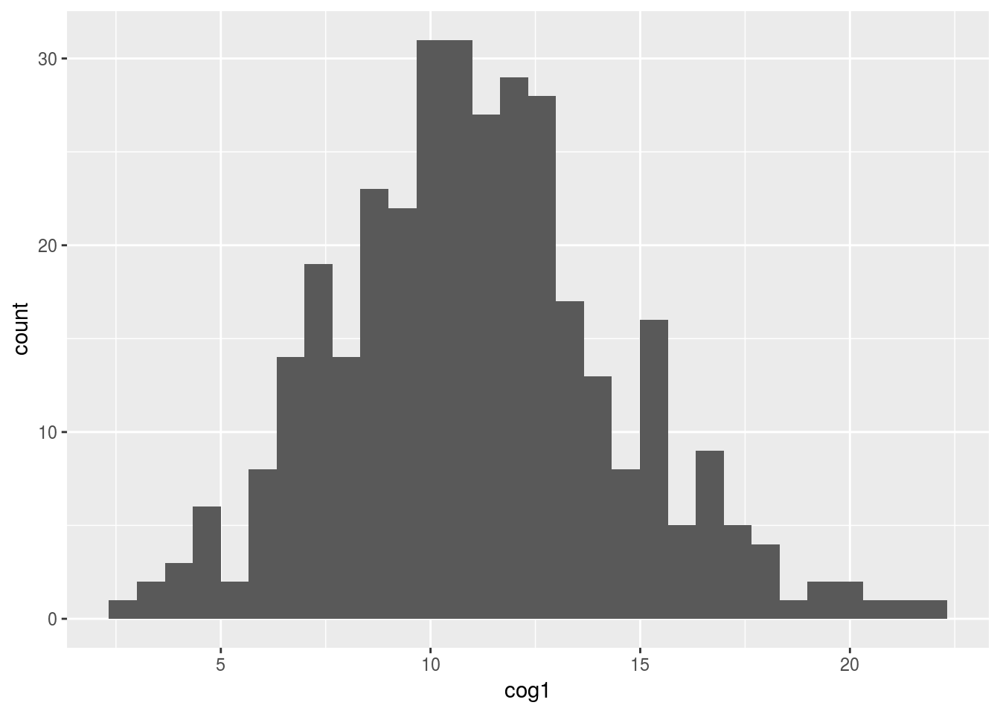
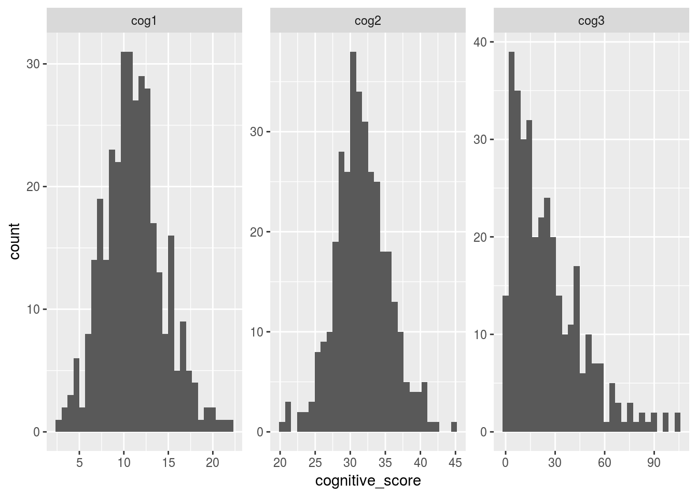
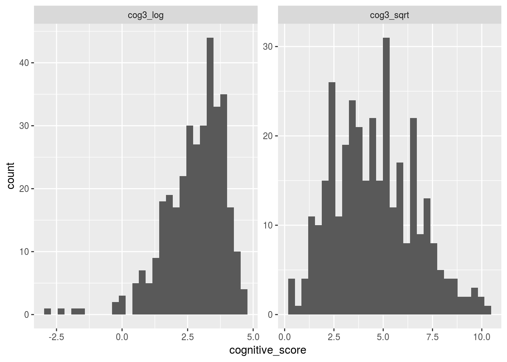
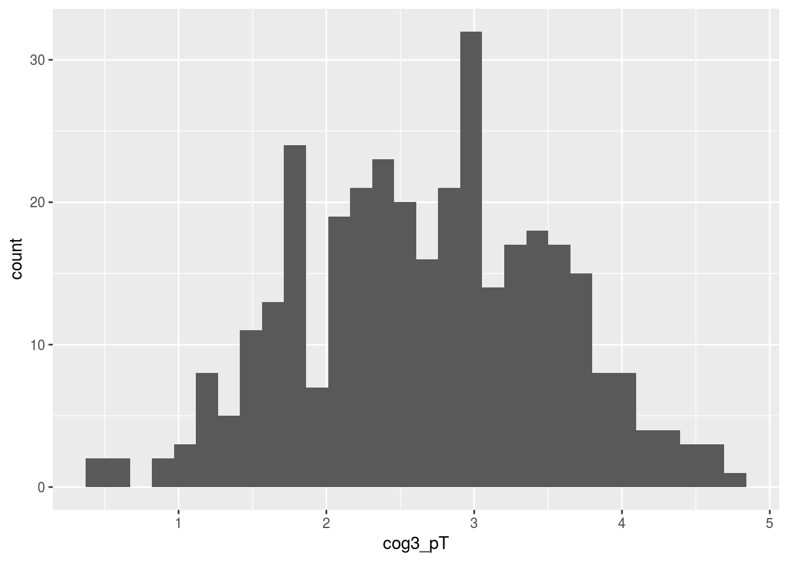
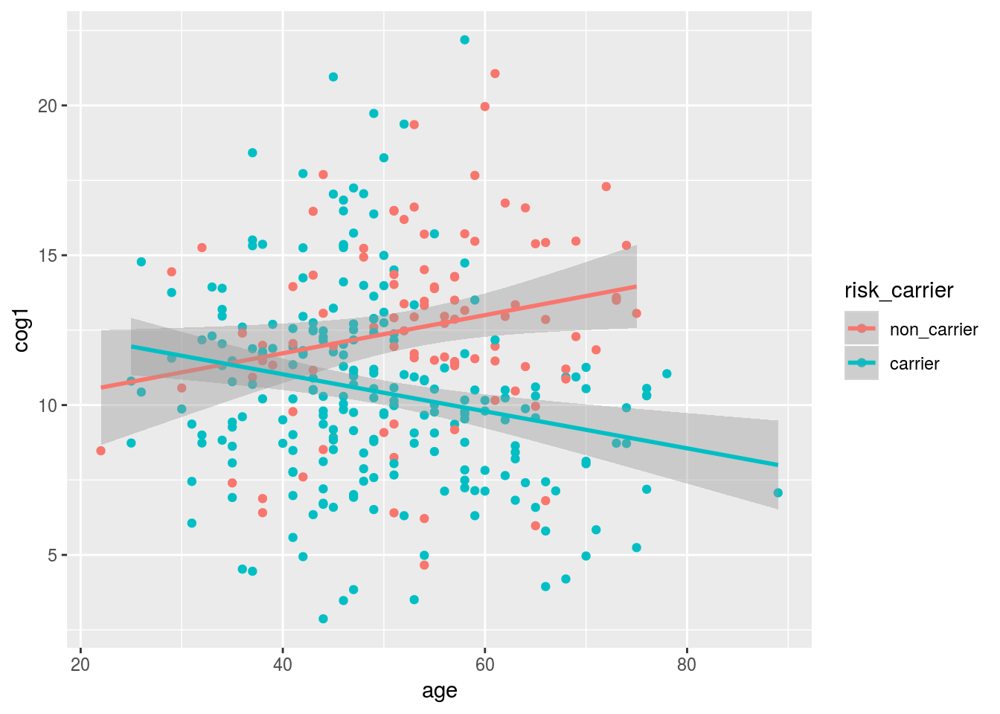
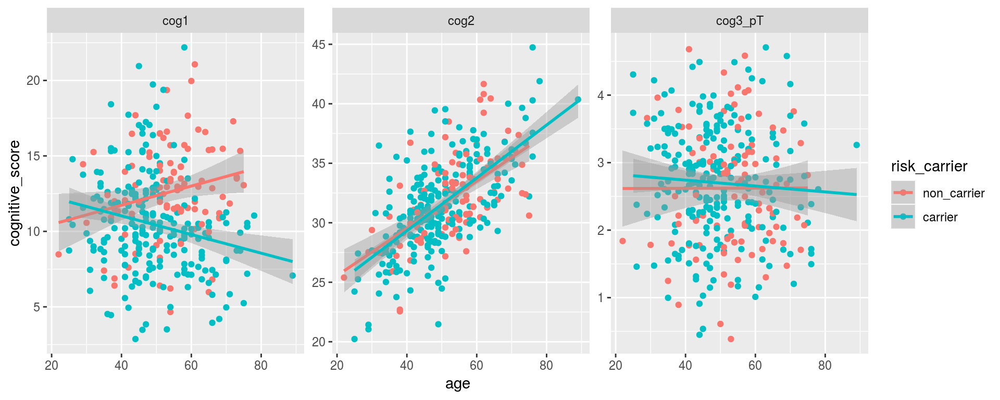
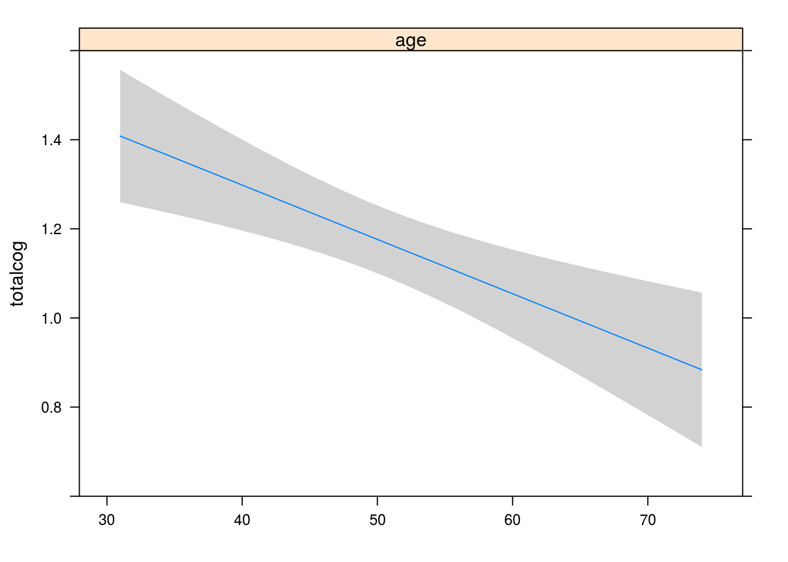
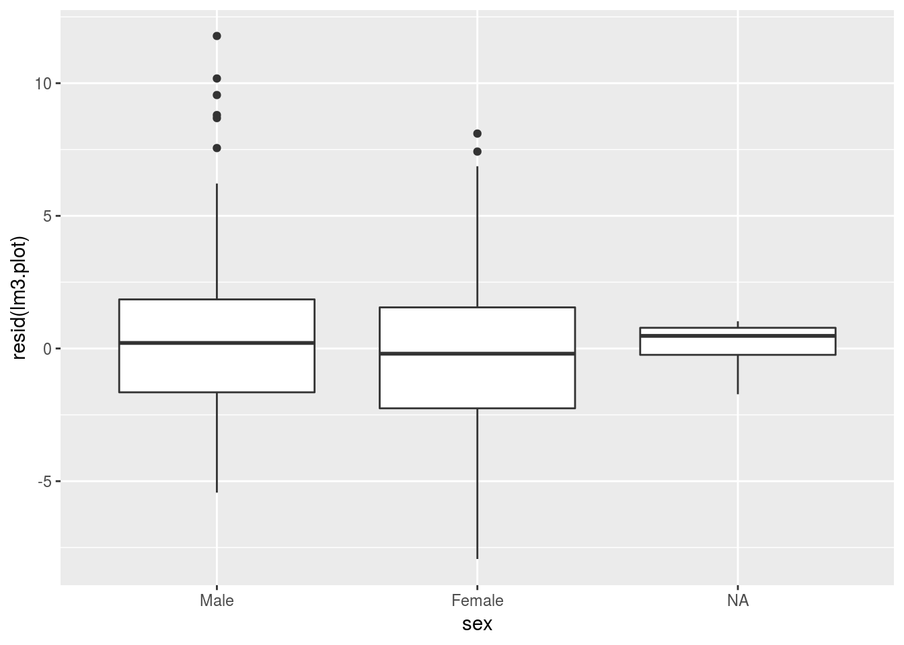

# Stats (Linear Models)

Please download the following files:


1. [messy_demographic.csv](data/messy_demographic.csv) 
2. [messy_cognitive.csv](data/messy_cognitive.csv)
3. [messy_genotype.csv](data/messy_genotype.csv)

----


We need 'rms', 'ggplot2', and 'car' packages
If you haven't already installed these:

Load the packages


```r
library(tidyverse)
library(dplyr)
library(tidyr)
library(broom)
library(readr)
```


#### p.s. today we are going to use the "pipe" `%>%`

`%>%` is the pipe 
The pipe takes the data from the left of if and feeds it to the function on the next line. Below are two ways for writing the same command.


```r
select(alldata, cog1:cog3)
alldata %>% 
  select(cog1:cog3)
```

## Set up (Running Intro to R commands)

*Note: we're going to use `read_csv()` from the `readr` package instead of base R's read.csv because it is a little more robust.*


```r
messy_demographic <- read_csv("~/Downloads/messy_demographic.csv")  # put in the location of the downloaded data file 1
messy_cognitive <- read_csv("~/Downloads/messy_cognitive.csv")  # put in the location of the downloaded data file 2
data3 <- read_csv("~/Downloads/messy_genotype.csv")
```


```
## Parsed with column specification:
## cols(
##   subject_ID = col_character(),
##   age = col_character(),
##   sex = col_integer(),
##   ethnicity = col_character(),
##   dx = col_character()
## )
```

```
## Parsed with column specification:
## cols(
##   subID = col_character(),
##   cog1 = col_character(),
##   cog2 = col_character(),
##   cog3 = col_character()
## )
```

```
## Parsed with column specification:
## cols(
##   subID = col_character(),
##   genotype = col_character()
## )
```

The data should be merged and ready to go from day 1. If not, here's the code for it:
Copied from [here](https://camh-scwg.github.io/compucool-may-2017/workshops/stats_with_R)


```r
## I'm using require, it's actually pretty much the same thing as "library"
require(dplyr)
require(stringr)
require(readr)
## we know that we need we have a same missing value issues in all three dataframes
## to avoid copying and pasting 3 times let's set them to a function
recode_missing <- function(df) {
  df[df==""] <- NA
  df[df=="missing"] <- NA
  df[df=="9999"] <- NA
  df[df==9999] <- NA
  return(df)
}
## pipeping messy demographic to the function we made
## then defining the factors inside a call to mutate
## note I use readr::parse_number(), which less error prone version of as.numeric() 
clean_demographic <- messy_demographic %>%
  recode_missing() %>%
  mutate(age = parse_number(age),
         ethnicity = factor(ethnicity,
                            levels=c("Cauc","AA","As","In","Other")),
         sex = factor(sex, levels = c(0,1),
                            labels = c("Male","Female")),
         dx = factor(dx, levels=c(0,1), 
                           labels=c("Control","Case")))
## recoding missing values in using out hand made recode_missing function
## then I use dplyr mutate_at to convert all 3 cog vars to a number
clean_cognitive <- messy_cognitive %>%
  recode_missing() %>%
  mutate_at(vars(cog1:cog3), funs(parse_number(.)))
## recode and set genotype to a factor
clean_genotype <- messy_genotype %>%
  recode_missing() %>%
  mutate(genotype = factor(genotype, 
                           levels=c(0,1,2), 
                           labels=c("AA","AG","GG")))
## use stringr to make the subject IDs match
## use dplyr's inner_join to put all three together
## use select to remove the extra column and put "subID" as the first column
alldata <- clean_demographic %>%
  mutate(subID = str_replace(subject_ID, "SUB_", "subject")) %>%
  inner_join(clean_cognitive, by = "subID") %>%
  inner_join(clean_genotype, by = "subID") %>%
  select(subID, everything(), -subject_ID)
## remove the intermediate data from your workspace
rm(messy_demographic, messy_cognitive, messy_genotype,
   clean_genotype, clean_cognitive, clean_demographic)
```

## A very fast stats refresher!!

### what stat function do I need??

For today, we are going to focus on what are called "parametric" statistics. We can spend a semester (and many people do) describing the uses of different statistical tests. However today, to pick the "best" statistical test there are two real questions:

1. What type of data is my dependant variable ("y")?
2. What type of data is my independant/predictor variable ("x")?

|               |        |**Dependant Variable (y)**                          |
|---------------|--------|----------------------------|-----------------------|
|               |        |*Factor*                    |*Numeric*              |
|**Independant (x)**| *Factor*    | Chi-Squared `chisq.test(ftable(y~x))`| t-test`t.test(y~x)` OR ANOVA `anova(lm(y~x))`|
|                   |*Numeric*    |Logistic Regression `glm(y~x,family=binomial())` | Correlation`cor.test(y~x)` OR Regression `lm(y ~ x)` |
|                   |*Combination (or multiple)* |Logistic Regression `glm(y~x1 + x2,family=binomial())`| Multiple Regression `lm(y ~ x1 + x2)`|

This table is generally works, UNLESS:

1. Your data is not normally distributed (we will test for that later...).
    + is this is an issue..you will need to enter the land of non-parametric statistics
2. Your data is not "independant", in other words you have a "repeated-measures design"
    + you might need a *paired t.test* or *repeated measures ANOVA*
3. You have more than one dependant variable. 
    + Then you need to enter the realm of multivariate statistics.. 

There are tools for all of this in R.  But I will not go into them during this tutorial

**Most of what we want to do, we can do with the linear model (`lm`)**

## Looking at Cognition 2 vs Age

The linear model function in R (`lm`), like many stats functions in R, uses *formula notation*, where you describe you dependant and independant variables, separated by a tilda `~`.

Let's take an example where we want to predict the scores on cognitive scale 2 using our age variable.

In the next chuck we create a *linear model fit* object. An then call summary on that object.


```r
fit_cog2_age <-lm(cog2 ~ age, data = alldata) # creates lm "fit" object
summary(fit_cog2_age)                         # prints a summary report of the fit
```

```
## 
## Call:
## lm(formula = cog2 ~ age, data = alldata)
## 
## Residuals:
##     Min      1Q  Median      3Q     Max 
## -9.8482 -1.9839 -0.0404  1.5766  8.7988 
## 
## Coefficients:
##             Estimate Std. Error t value Pr(>|t|)    
## (Intercept) 20.85385    0.72780   28.65   <2e-16 ***
## age          0.21359    0.01405   15.20   <2e-16 ***
## ---
## Signif. codes:  0 '***' 0.001 '**' 0.01 '*' 0.05 '.' 0.1 ' ' 1
## 
## Residual standard error: 2.947 on 335 degrees of freedom
##   (13 observations deleted due to missingness)
## Multiple R-squared:  0.4083,	Adjusted R-squared:  0.4065 
## F-statistic: 231.1 on 1 and 335 DF,  p-value: < 2.2e-16
```

## Using `broom` to save/organize model fit numbers

The best part about running stats in R, in contrast to running your stats in some other "point and click" interface. I that your statistical results (i.e. you test stats, residuals, p values) can all be saved into objects that you can later format into tables, plot, print directly into your report...This is very powerful.

Statistical result objects can be tough to work with. The `broom` package extract numbers from statistical fit results into dataframes that are easier to work with.

### `augment` grabs residuals and predicted values


```r
cogbyage_aug <- alldata %>%
  do(augment(lm(cog2~age,data = .)))
head(cogbyage_aug)
```

```
##   .rownames     cog2 age  .fitted   .se.fit      .resid        .hat
## 1         1 28.82050  43 30.03823 0.1922539 -1.21773373 0.004255104
## 2         2 37.46947  47 30.89260 0.1680257  6.57687558 0.003250207
## 3         3 37.72990  69 35.59159 0.3051575  2.13831656 0.010720322
## 4         4 31.66686  51 31.74696 0.1606849 -0.08009890 0.002972417
## 5         5 31.41426  52 31.96055 0.1618742 -0.54629124 0.003016580
## 6         6 36.05572  71 36.01877 0.3293842  0.03695909 0.012490085
##     .sigma      .cooksd  .std.resid
## 1 2.950925 3.663098e-04 -0.41405515
## 2 2.929588 8.145312e-03  2.23514884
## 3 2.949335 2.882992e-03  0.72944467
## 4 2.951677 1.104278e-06 -0.02721779
## 5 2.951528 5.213355e-05 -0.18563513
## 6 2.951679 1.007059e-06  0.01261916
```

### `tidy` grabs to middle table (beta's and t-stats)


```r
cogbyage_tidy <- alldata %>%
  do(tidy(lm(cog2~age,data = .)))
cogbyage_tidy
```

```
##          term   estimate  std.error statistic      p.value
## 1 (Intercept) 20.8538467 0.72779789  28.65335 4.088251e-92
## 2         age  0.2135904 0.01404897  15.20328 4.592760e-40
```

### `glance` grabs to full model stats 


```r
cogbyage_glance <- alldata %>%
  do(glance(lm(cog2~age,data = .)))
cogbyage_glance
```

```
##   r.squared adj.r.squared    sigma statistic     p.value df    logLik
## 1 0.4082732     0.4065069 2.947271  231.1397 4.59276e-40  2 -841.4358
##        AIC      BIC deviance df.residual
## 1 1688.872 1700.332 2909.947         335
```

## Example: printing our formatted t

### now that things are nicely organized we can built tables for our publications, compare across models, and print results to our report 


```r
my_t_stat <- cogbyage_tidy %>%
  dplyr::filter(term == "age") %>%
  select(statistic) %>%
  round(.,2) ## round to 2 decimal places
print(my_t_stat)
```

```
##   statistic
## 1      15.2
```

### Printing a result to our report

The following line:
We observe a significant relationship between age adn cognitive scale 2 (t = 15.2, p = 4.5927599\times 10^{-40})

was written in markdown as:

```
We observe a significant relationship between age adn cognitive scale 2 (t = 15.2, p = 4.5927599\times 10^{-40})
```

## plotting distributions

### Using ggplot to plot a histogram of cognition score 1


```r
ggplot(alldata, aes(x=cog1)) + geom_histogram()
```

```
## `stat_bin()` using `bins = 30`. Pick better value with `binwidth`.
```

```
## Warning: Removed 5 rows containing non-finite values (stat_bin).
```



### Using a combination of "gather" and ggplot to plot all three scores in one plot


```r
alldata %>%
  gather(cognitive_scale, cognitive_score, 
         cog1:cog3) %>%
  ggplot(aes(x = cognitive_score)) +
    geom_histogram() +
    facet_wrap(~cognitive_scale, scales = "free")
```

```
## `stat_bin()` using `bins = 30`. Pick better value with `binwidth`.
```

```
## Warning: Removed 19 rows containing non-finite values (stat_bin).
```



## Transforming variables to "normal"

From the histogram above.. It looks like `cog3` is not normally distributed. This is a problem because it violates "the assumption of normally", and therefore parametric tests (i.e. the linear model) should not be run in this case.

One solution to this problem is to transform this variable into normally distributed variables, and then do the stats on those.

Let's use `dplyr`'s `mutate` function to calculate a log (i.e. log10) and square-root transform (`sqrt`).


```r
alldata <- alldata %>%
  mutate(cog3_log  = log(cog3),
         cog3_sqrt = sqrt(cog3))
```

Let's plot histograms of these new values


```r
alldata %>%
  gather(cognitive_scale, cognitive_score, 
         cog3_log, cog3_sqrt) %>%
  ggplot(aes(x = cognitive_score)) +
    geom_histogram() +
    facet_wrap(~cognitive_scale, scales = "free")
```

```
## `stat_bin()` using `bins = 30`. Pick better value with `binwidth`.
```

```
## Warning: Removed 18 rows containing non-finite values (stat_bin).
```



## Using "power transform" from the `car` library

The people behind the `car` library decided to use their computer's to find the perfect transform!

The function `powerTransform` magically finds the perfect transform!


```r
library(car)
```

```
## Loading required package: carData
```

```
## 
## Attaching package: 'car'
```

```
## The following object is masked from 'package:dplyr':
## 
##     recode
```

```
## The following object is masked from 'package:purrr':
## 
##     some
```

```r
# calculate the best exponent using powerTransform:
pT <- powerTransform(alldata$cog3)
# apply the power transform and save the result to a new variable
alldata$cog3_powerT <- alldata$cog3^pT$lambda ## note ^ is exponent in r
```

Using `powerTransform` is a little tricky (it requires two steps). When things get tricky in R, it's nice to wrap what you want to do inside a function. That way, you can call the function instead of remembering all the steps next time you want to do something!


```r
## run the power transform, return the transformed variable
## where x is a vector of values
get_pT <- function(x) {
 pT <- x^powerTransform(x)$lambda
 return(pT)
}
alldata <- alldata %>%
  mutate(cog3_pT = get_pT(cog3))
ggplot(alldata, aes(x=cog3_pT)) + geom_histogram()
```

```
## `stat_bin()` using `bins = 30`. Pick better value with `binwidth`.
```

```
## Warning: Removed 9 rows containing non-finite values (stat_bin).
```



## Recodeding our genotype into risk-allele carriers vs non-carriers


```r
summary(alldata$genotype)
```

```
##   AA   AG   GG NA's 
##  103  145   94    8
```


```r
library(forcats)
alldata <- alldata %>%
  mutate(risk_carrier = fct_recode(genotype,
                                   carrier = "GG",
                                   carrier = "AG",
                                   non_carrier = "AA"))
```


## Investigating Interactions 

### fitting our data with an age by risk-carrier interaction

The concept of statistical interaction goes by many names and has many definitions.  Simply this is the concept that the effect of one variable changes depending on the value of another variable. 

Interaction is indicated in R formula syntax with a ":" or `*`, depending on if you want to automatically include the main effects of your interacting variables or not. As a general rule, always use `*`.


```r
fit2 <- lm(cog1 ~ age*risk_carrier, data = alldata)
summary(fit2)
```

```
## 
## Call:
## lm(formula = cog1 ~ age * risk_carrier, data = alldata)
## 
## Residuals:
##     Min      1Q  Median      3Q     Max 
## -7.9601 -1.9774 -0.0874  1.6888 12.2729 
## 
## Coefficients:
##                         Estimate Std. Error t value Pr(>|t|)    
## (Intercept)              9.18323    1.61921   5.671 3.12e-08 ***
## age                      0.06365    0.02967   2.145 0.032678 *  
## risk_carriercarrier      4.31736    1.85584   2.326 0.020611 *  
## age:risk_carriercarrier -0.12545    0.03468  -3.617 0.000345 ***
## ---
## Signif. codes:  0 '***' 0.001 '**' 0.01 '*' 0.05 '.' 0.1 ' ' 1
## 
## Residual standard error: 3.164 on 326 degrees of freedom
##   (20 observations deleted due to missingness)
## Multiple R-squared:  0.1272,	Adjusted R-squared:  0.1191 
## F-statistic: 15.83 on 3 and 326 DF,  p-value: 1.234e-09
```


```r
alldata %>%
  drop_na(risk_carrier) %>%
ggplot(aes(x = age, y = cog1, color = risk_carrier)) +
  geom_point() +
  geom_smooth(method = "lm")
```

```
## Warning: Removed 12 rows containing non-finite values (stat_smooth).
```

```
## Warning: Removed 12 rows containing missing values (geom_point).
```



### Plotting all three cognitve variables at once!


```r
alldata %>%
  gather(cognitive_scale, cognitive_score, 
         cog1, cog2, cog3_pT) %>%
  drop_na(risk_carrier) %>%
  ggplot(aes(y = cognitive_score, x = age, color = risk_carrier)) +
    geom_point() +
    geom_smooth(method = "lm") +
    facet_wrap(~cognitive_scale, scales = "free")
```

```
## Warning: Removed 40 rows containing non-finite values (stat_smooth).
```

```
## Warning: Removed 40 rows containing missing values (geom_point).
```



### Running our linear model on all three cognitive variables at once!


```r
lm_results <- alldata %>%
  gather(cognitive_scale, cognitive_score, 
         cog1, cog2, cog3_pT) %>%
  drop_na(risk_carrier) %>%
  group_by(cognitive_scale) %>%
  do(tidy(lm(cognitive_score ~ age*risk_carrier, data = .)))
library(knitr)
kable(lm_results %>%
  select(cognitive_scale, term, statistic, p.value) %>%
    arrange(p.value))
```


cognitive_scale   term                        statistic     p.value
----------------  ------------------------  -----------  ----------
cog2              (Intercept)                14.1811015   0.0000000
cog2              age                         7.1325824   0.0000000
cog3_pT           (Intercept)                 5.9003102   0.0000000
cog1              (Intercept)                 5.6714248   0.0000000
cog1              age:risk_carriercarrier    -3.6168948   0.0003454
cog1              risk_carriercarrier         2.3263728   0.0206113
cog1              age                         2.1451691   0.0326778
cog2              age:risk_carriercarrier     0.7207797   0.4715616
cog2              risk_carriercarrier        -0.6541716   0.5134625
cog3_pT           risk_carriercarrier         0.5955776   0.5518758
cog3_pT           age:risk_carriercarrier    -0.4754718   0.6347731
cog3_pT           age                         0.0187474   0.9850542

## use p.adjust to correct for multiple comparisons


```r
age_effects <- lm_results %>%
  dplyr::filter(term == "age")
age_effects$p.FDR <- p.adjust(age_effects$p.value, method = "fdr")
kable(age_effects)
```


cognitive_scale   term     estimate   std.error   statistic     p.value       p.FDR
----------------  -----  ----------  ----------  ----------  ----------  ----------
cog1              age     0.0636475   0.0296701   2.1451691   0.0326778   0.0490167
cog2              age     0.1986365   0.0278492   7.1325824   0.0000000   0.0000000
cog3_pT           age     0.0001522   0.0081193   0.0187474   0.9850542   0.9850542

## BONUS SECTION: using `rms` to get more details

When you want more detailed info out of your models. The `rms` library can be very useful.


#### total_behaviour_score ~ age 
 
Calculate a composite variable by combining multiple variables
Note: new variables can be made easily (using dplyr's mutate verb)


```r
alldata$totalcog <- (alldata$cog1 + alldata$cog3) / alldata$cog2
```


Simple linear regression (two ways: base package and rms)


```r
library(rms)
```

```
## Loading required package: Hmisc
```

```
## Loading required package: lattice
```

```
## Loading required package: survival
```

```
## Loading required package: Formula
```

```
## 
## Attaching package: 'Hmisc'
```

```
## The following objects are masked from 'package:dplyr':
## 
##     src, summarize
```

```
## The following objects are masked from 'package:base':
## 
##     format.pval, units
```

```
## Loading required package: SparseM
```

```
## Loading required package: methods
```

```
## 
## Attaching package: 'SparseM'
```

```
## The following object is masked from 'package:base':
## 
##     backsolve
```

```
## 
## Attaching package: 'rms'
```

```
## The following objects are masked from 'package:car':
## 
##     Predict, vif
```

```r
lm.base <- lm(data=alldata, totalcog ~ age)
lm.rms <- ols(data=alldata, totalcog ~ age)
```

Let's compare the output's


```r
lm.base
```

```
## 
## Call:
## lm(formula = totalcog ~ age, data = alldata)
## 
## Coefficients:
## (Intercept)          age  
##     1.78587     -0.01219
```

```r
summary(lm.base)
```

```
## 
## Call:
## lm(formula = totalcog ~ age, data = alldata)
## 
## Residuals:
##     Min      1Q  Median      3Q     Max 
## -1.0529 -0.5054 -0.1940  0.4352  2.3720 
## 
## Coefficients:
##              Estimate Std. Error t value Pr(>|t|)    
## (Intercept)  1.785875   0.172793  10.335  < 2e-16 ***
## age         -0.012192   0.003346  -3.644 0.000313 ***
## ---
## Signif. codes:  0 '***' 0.001 '**' 0.01 '*' 0.05 '.' 0.1 ' ' 1
## 
## Residual standard error: 0.6966 on 322 degrees of freedom
##   (26 observations deleted due to missingness)
## Multiple R-squared:  0.03961,	Adjusted R-squared:  0.03663 
## F-statistic: 13.28 on 1 and 322 DF,  p-value: 0.0003125
```

```r
anova(lm.base)
```

```
## Analysis of Variance Table
## 
## Response: totalcog
##            Df  Sum Sq Mean Sq F value    Pr(>F)    
## age         1   6.445  6.4446   13.28 0.0003125 ***
## Residuals 322 156.259  0.4853                      
## ---
## Signif. codes:  0 '***' 0.001 '**' 0.01 '*' 0.05 '.' 0.1 ' ' 1
```

**Note**: to make the most out of rms package functionality, we need to store summary stats using the datadist() function. That way, when we call summary() on an ols() object (we just made one called "lm.rms") it will give us useful info. 


```r
dd.alldata <- datadist(alldata)
options(datadist="dd.alldata")
lm.rms
```

```
## Frequencies of Missing Values Due to Each Variable
## totalcog      age 
##       18        8 
## 
## Linear Regression Model
##  
##  ols(formula = totalcog ~ age, data = alldata)
##  
##  
##                 Model Likelihood     Discrimination    
##                    Ratio Test           Indexes        
##  Obs     324    LR chi2     13.09    R2       0.040    
##  sigma0.6966    d.f.            1    R2 adj   0.037    
##  d.f.    322    Pr(> chi2) 0.0003    g        0.160    
##  
##  Residuals
##  
##      Min      1Q  Median      3Q     Max 
##  -1.0529 -0.5054 -0.1940  0.4352  2.3720 
##  
##  
##            Coef    S.E.   t     Pr(>|t|)
##  Intercept  1.7859 0.1728 10.34 <0.0001 
##  age       -0.0122 0.0033 -3.64 0.0003  
## 
```

```r
summary(lm.rms)
```

```
##              Effects              Response : totalcog 
## 
##  Factor Low High Diff. Effect   S.E.     Lower 0.95 Upper 0.95
##  age    43  58   15    -0.18288 0.050183 -0.28161   -0.084151
```

```r
anova(lm.rms)
```

```
##                 Analysis of Variance          Response: totalcog 
## 
##  Factor     d.f. Partial SS MS        F     P    
##  age          1    6.444638 6.4446382 13.28 3e-04
##  REGRESSION   1    6.444638 6.4446382 13.28 3e-04
##  ERROR      322  156.258677 0.4852754
```

Visualize predicted results using rms

```r
plot(Predict(lm.rms))
```



## ols gets more powerful as the model get's more complicated

This is were we start to add covariates and do multiple regression


```r
lm3 <- ols(data=alldata, cog1 ~ age*risk_carrier + sex )
lm3
```

```
## Frequencies of Missing Values Due to Each Variable
##         cog1          age risk_carrier          sex 
##            5            8            8            4 
## 
## Linear Regression Model
##  
##  ols(formula = cog1 ~ age * risk_carrier + sex, data = alldata)
##  
##  
##                 Model Likelihood     Discrimination    
##                    Ratio Test           Indexes        
##  Obs     326    LR chi2     49.39    R2       0.141    
##  sigma3.1587    d.f.            4    R2 adj   0.130    
##  d.f.    321    Pr(> chi2) 0.0000    g        1.432    
##  
##  Residuals
##  
##       Min       1Q   Median       3Q      Max 
##  -7.61165 -2.06275 -0.03454  1.86219 11.69825 
##  
##  
##                             Coef    S.E.   t     Pr(>|t|)
##  Intercept                   9.7644 1.6478  5.93 <0.0001 
##  age                         0.0622 0.0299  2.08 0.0386  
##  risk_carrier=carrier        4.3775 1.8678  2.34 0.0197  
##  sex=Female                 -0.8926 0.3636 -2.45 0.0146  
##  age * risk_carrier=carrier -0.1251 0.0349 -3.59 0.0004  
## 
```

```r
anova(lm3)
```

```
##                 Analysis of Variance          Response: cog1 
## 
##  Factor                                            d.f. Partial SS
##  age  (Factor+Higher Order Factors)                  2   165.95975
##   All Interactions                                   1   128.34287
##  risk_carrier  (Factor+Higher Order Factors)         2   432.58671
##   All Interactions                                   1   128.34287
##  sex                                                 1    60.13082
##  age * risk_carrier  (Factor+Higher Order Factors)   1   128.34287
##  REGRESSION                                          4   523.84580
##  ERROR                                             321  3202.66179
##  MS        F     P     
##   82.97987  8.32 0.0003
##  128.34287 12.86 0.0004
##  216.29335 21.68 <.0001
##  128.34287 12.86 0.0004
##   60.13082  6.03 0.0146
##  128.34287 12.86 0.0004
##  130.96145 13.13 <.0001
##    9.97714
```

```r
summary(lm3)
```

```
##              Effects              Response : cog1 
## 
##  Factor                             Low High Diff. Effect   S.E.   
##  age                                43  58   15    -0.94428 0.26908
##  risk_carrier - non_carrier:carrier  2   1   NA     1.75290 0.41015
##  sex - Male:Female                   2   1   NA     0.89259 0.36358
##  Lower 0.95 Upper 0.95
##  -1.47370   -0.41489  
##   0.94596    2.55980  
##   0.17728    1.60790  
## 
## Adjusted to: age=49 risk_carrier=carrier
```


## BONUS SECTION 2 - the "right" way to plot....

**How to visualize a significant effect from our regression...Controlling for the other variables in the model....**
 
To visualize a given effect more informatively, we want to caculate the residuals of the model lacking our co-varitate of interest and plot those residuals as our outcome:

For genotype we want a boxplot of model residuals:


```r
lm3.plot <- ols(data=alldata, cog1 ~ genotype + age)
ggplot(data=alldata, aes(y=resid(lm3.plot), x=sex)) + 
  geom_boxplot()
```

```
## Warning: Removed 20 rows containing non-finite values (stat_boxplot).
```


